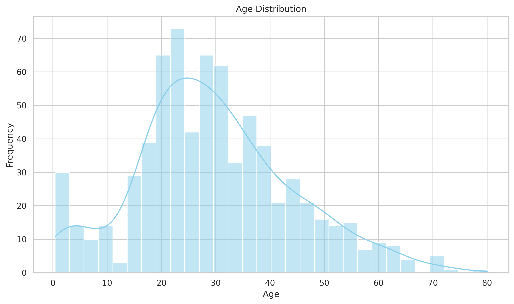
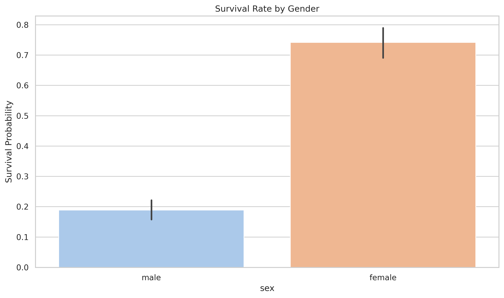
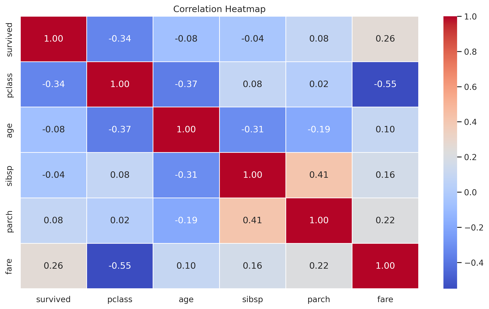

# CelebalTechAssignmentWeek4
# Titanic Dataset - Exploratory Data Analysis 🚢📊

A detailed Exploratory Data Analysis (EDA) project on the Titanic dataset using Python, Pandas, Seaborn, and Matplotlib.  
This project explores survival patterns using data profiling, missing value visualization, univariate & bivariate analysis, outlier detection, and a beautiful interactive notebook.

---

## 📁 Project Structure
CelebalTechAssignmentWeek4/
├── titanic_eda.py # Main analysis script  
├── titanic_eda.ipynb # Jupyter Notebook with code + output  
├── visuals/ # Folder of saved plot images  
├── titanic_profiling_report.html # Full interactive profiling report  
├── requirements.txt # Required Python packages  
├── README.md # This file  
└── LICENSE # MIT License  

---

## 📘 Interactive Notebook

✅ View the step-by-step analysis with code **and outputs** in the Jupyter notebook:  
👉 [titanic_eda.ipynb](titanic_eda.ipynb)

---

## 📊 What’s Inside?

### Key Analysis Sections:
- 📥 Load & explore the dataset
- 🔍 Data profiling & unique value analysis
- 🧱 Missing value heatmaps & bar plots
- 📈 Univariate analysis (Age, Fare, Gender, Class, etc.)
- 🧮 Bivariate analysis (Survival by gender/class/fare/embarked)
- 🧪 Outlier detection using IQR

---

## 📄 Profiling Report

This project includes an **interactive profiling report** generated using [`ydata-profiling`](https://pypi.org/project/ydata-profiling/). It provides a comprehensive, automatic analysis of the dataset.

### 📂 How to View It
The file `titanic_profiling_report.html` is saved in the root of this project.

### Sample Visuals:
| Plot                          | Example |
|-------------------------------|---------|
| Age Distribution              |  |
| Survival by Gender            |  |
| Correlation Heatmap           |  |

---

